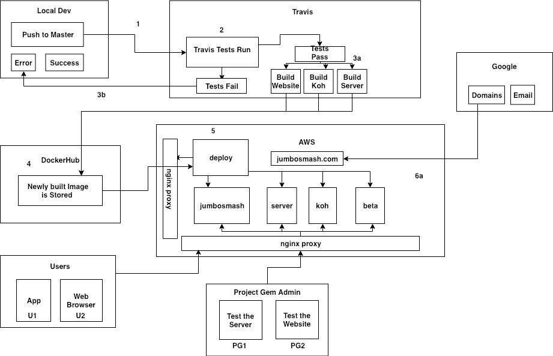

# Deploy

Deploy is a component dedicated to handling some considerations of our deployment process.

## Goals

* Document the necessary files to deploy our various applications and environments and serve as a version control for the deployment process.

* Expose a node js web server, `deploy.jumbosmash.com`, whose endpoints allow [dockerhub](https://hub.docker.com/) to [automatically](https://docs.docker.com/docker-hub/webhooks/) send `POST` requests and information to it. Further details can be found in `deploy/README.md`.

## System Architecture  

An editable version of our system diagram can be found [here](https://drive.google.com/file/d/18lGvUnp-HuKm_aOY-EH1pVw1YGpRW55L/view?usp=sharing).

## Deployment Process

# TODO

## User Flows
* TODO - Map out what machines and services are hit based upon our various admin and normal user flows.

### Docker Image Tagging Convention
* TODO - We need a standard way of cutting releases and mapping those to docker images either by commits or something.

### Getting Started Locally

This will be the best steps for getting the full production stack
up and deployed as closely as possible to the production deployment

* Install docker locally
* `docker swarm init`
* `docker stack deploy --with-registry-auth  -c dev.yml pg`
