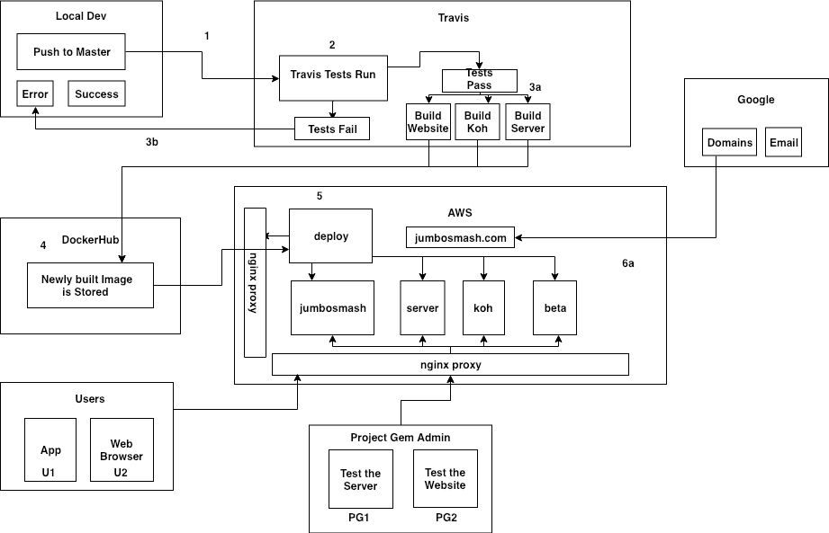

# Deploy

Deploy is a component dedicated to handling some considerations of our deployment process.

## Goals

* Document the necessary files to deploy our various applications and environments and serve as a version control for the deployment process.

* Expose a python web server, `deploy.jumbosmash.com`, whose endpoints allow [dockerhub](https://hub.docker.com/) to [automatically](https://docs.docker.com/docker-hub/webhooks/) send `POST` requests and information to it. Further details can be found in `deploy/README.md`.

## System Architecture  

An editable version of our system diagram can be found [here](https://drive.google.com/file/d/18lGvUnp-HuKm_aOY-EH1pVw1YGpRW55L/view?usp=sharing).

## Deployment Process

## User Flows
* TODO - Map out what machines and services are hit based upon our various admin and normal user flows.

## Structure and Convention

The first level directory of deploy should have a folder for each service that we require.

* `deploy`
* `beta`
* `jumbosmash`
* `koh`
* `server`

Each folder's name (except for `proxy/`) corresponds to its subdomain/domain equivalent on the production machine.
  * For example, `beta/` contains all deployment procedures associated with `beta.jumbosmash.com`
  * `deploy/` is a special case since it includes the web app's source code as well as its deployment processes.
  * Editing subdomains can be done through our google [domain](https://domains.google/#/) account.

### Docker Image Tagging Convention
* TODO - We need a standard way of cutting releases and mapping those to docker images either by commits or something.
